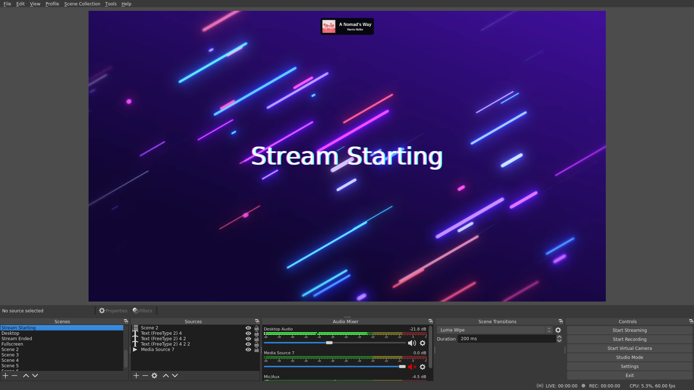

# MPDbs

MPDbs is a simple way to add MPD support into OBS.



## Prerequisites

 * MPD
 * Yarn
 * Node.js

## How to install

```
$ git clone --depth 1 https://github.com/xSlendiX/mpdbs.git
$ cd mpdbs
$ yarn
```

The process should be similar in Windows but I am not familiar with it.

## How to start

```
$ yarn start
```

## Changing position of widget

Open up `views/pages/status_small.ejs` and change the classes of the body tag.

## Changing color scheme

Open up `views/pages/status_small.ejs` and change the `black` from the card into `white`.

